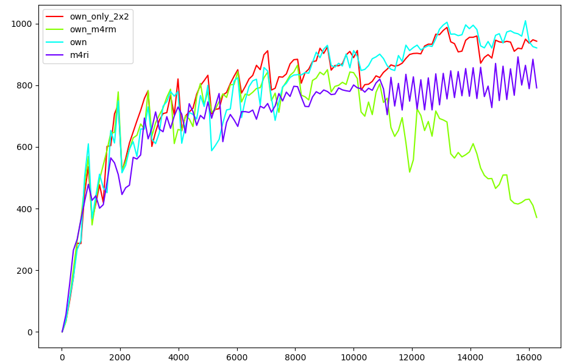

# GF2MUL

Matrix multiplication in $\mathbb{F}_2$, using the Method of the Four Russians together with the block matrix multiplications of [AlphaTensor](https://github.com/google-deepmind/alphatensor).

This is a toy project of mine where I aimed to understand the performance intricacies behind libraries like [m4ri](https://github.com/malb/m4ri) (the state of the art AFAIK). I implement the Method of the Four Russians to speed up the base-case multiplication but also use the new algorithm for $4 \times 4$ block matrix multiplication in $\mathbb{F}_2$ found by [AlphaTensor](https://github.com/google-deepmind/alphatensor). I do also implement their $3 \times 3$ and $5 \times 5$ multiplication routines, but they are not used in the current automatic algorithm.

Below is a chart of bit-operations per cycle (higher is better) for the different algorithms. As can be seen the method which only uses $2 \times 2$ block matrix multiplication is very similar in performance to the one which uses $4 \times 4$ block matrix multiplication, but the performance difference gets larger for larger matrices. `own_m4rm` is without doing any block matrix multiplication. This performance graph is just from one machine and because of the large importance of memory access patterns and cache behavior the performance might vary a lot between different machines.

